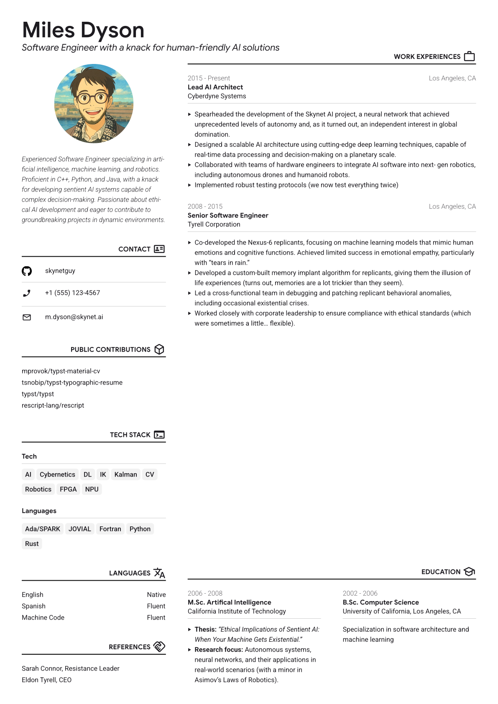

# Material-CV

A stylish and customizable résumé template for Typst, designed with elegant typographic variations.

Based on [tsnobip/typst-typographic-resume](https://github.com/tsnobip/typst-typographic-resume) with
the following changes:

- Put name and profession at the top where there is more space available

- Use Google Sans and Material Symbols icons in section headers

- Header of work entries and education entries have the same structure and formatting

- Added tags, available for use in sections like tech stack / skills

<a href="thumbnail.png">
    
</a>

## Usage

### Fonts

The default fonts are:

- ["Google Sans"](https://fonts.google.com/specimen/Google+Sans)

- ["Roboto"](https://fonts.google.com/specimen/Roboto)

- ["Material Symbols"](https://github.com/google/material-design-icons/tree/master/variablefont)

You can also copy paste the whole [fonts folder](https://github.com/mprovok/typst-material-cv/tree/main/fonts) in your project
for the Google Sans and Roboto fonts.

Make sure they're installed on your system, or change them in [Theme](#theme).

### Icons

You can search for icons at https://fonts.google.com/icons.

### From Typst app

Create a new project based on the template [material-cv](https://typst.app/universe/package/material-cv).

### Locally

Copy the [template](https://raw.githubusercontent.com/mprovok/typst-material-cv/main/template/main.typ) to your Typst project.

The text in the template is from [@preview/grotesk-cv](https://typst.app/universe/package/grotesk-cv).

### From a blank project

Import the library :

```typst
#import "@preview/material-cv:0.1.0": *
```

Show the root `resume` function :

```typst
#show: resume.with(
  theme: (),
  title: "CV",
  name: "Your first and last name",
  profession: "Your profession",
  bio: "Your bio",
  profile-picture: "link to your profile picture",
  aside: [
    ASIDE CONTENT
  ]
)

MAIN CONTENT
```

Several content functions are available.

**Section**

```typst
#section(
  theme: (),
  "TITLE_CONTENT",
  icon: "name_of_icon",
  "BODY_CONTENT",
)
```

**entry**

```typst
#entry(
  theme: (),
  timeframe: "Time period of this work experience",
  title: "Your job title",
  organization: "The name of the organization your worked for",
  location: "Work location",
  "Description of this work experience"
)
```

**tags-entry**

```typst
#tags-entry((
  [Tag 1], [Tag 2], [Tag 3]
))
```

## Theme

Customize the theme by specifying the `theme` parameter and overriding 1 or more keys.

### Function `resume`

| Key                     | Type     | Default               |
| ----------------------- | -------- | --------------------- |
| `margin`                | relative | `26pt`                |
| `font-size`             | relative | `8pt`                 |
| `font-body`             | str      | `"Roboto"`            |
| `font-header`           | str      | `"Google Sans 18pt"`  |
| `text-color`            | color    | `rgb("#1d1b20")`      |
| `tags-color`            | color    | `rgb("#f2f2f2")`      |
| `gutter-size`           | relative | `4em`                 |
| `main-width`            | relative | `6fr`                 |
| `aside-width`           | relative | `3fr`                 |
| `profile-picture-width` | relative | `55%`                 |

### Function `section`

| Key           | Type     | Default |
| ------------- | -------- | ------- |
| `space-above` | relative | 1fr     |
| `align-title` | relative | end     |

### Function `tags-entry`

| Key     | Type  | Default          |
| --------| ----- | ---------------- |
| `color` | color | `rgb("#f2f2f2")` |
